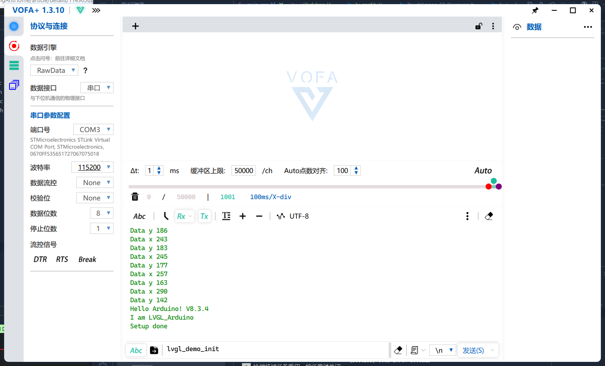

## 基于stm32duino+Adafruit+LVGL实现STM32F7XX/DISCO-F746NG板载TFT屏幕显示和触摸驱动

最初缘由是闲置了一块板子一直没用过，正好女朋友想要桌面时钟，便想借此机会利用一下它，然stm32cubeide+touchgfx的开发方式太过繁琐，期间工程被失误破坏两次；而拥抱arduino框架则可轻松接入各类套件，但该板载资源的资料较少，仍需要自行适配调整（入了新坑），便有了这项工程。

## 概述

- 使用stm32duino框架，加入LTDC配置
- TFT显示驱动调用Adafruit GFX实现，通过LVGL实现现代界面

## Notes

在platformio.ini添加使能LTDC

```ini
build_flags =
	-D HAL_LTDC_MODULE_ENABLED
```

LVGL提供了HAL库的支持，针对F7系列/DISCO-F746NG需添加标签：

```ini
build_flags =
	-D STM32F7
```

- [X] 2022/3/1 Adafruit GFX简易图形绘制测试成功
- [X] 2023/3/2 LVGL+Adafruit GFX for DISCO-F746NG触摸检测完成



- [ ] LVGL托管图层绘制调试中
